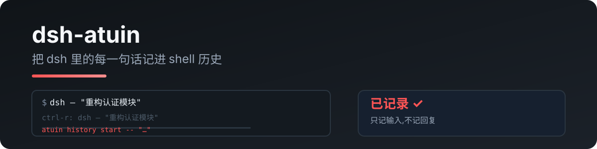

<p align="center">
  
</p>

# dsh-atuin

把你在 DeepSeek Harness 里输入的每一句话写进 **atuin** shell 历史——`atuin search`、shell 集成(Ctrl-R)里都能搜到。

> 由 [pi-atuin](https://github.com/RealAlexandreAI/pi-atuin) 移植。dsh 没有终端 UI,这就是它的 atuin 桥。

[English](README.md) · [中文](README.zh.md)

## 怎么工作

监听 `session/event` → `user/message`,对每条输入执行:

```
atuin history start -- "<输入>"
atuin history end --exit 0 <ID>
```

**只记录你自己输入的话**——回复、工具调用、文件内容一律不记。

## 快速开始

```sh
dsh plugin --profile web add dsh-atuin
```

需要 atuin daemon 在运行(标准 atuin 安装自带)。atuin 缺失或 daemon 停了会静默跳过,不会影响会话。

## 配置

```yaml
- id: atuin
  name: dsh-atuin
  config:
    # atuin_bin: /opt/homebrew/bin/atuin
    # deny: "^/clear$,password"
    # max_len: 2000
    # session_match: "project-x"
```

| 键 | 说明 |
|---|---|
| `atuin_bin` | atuin 可执行文件路径(默认 `atuin`) |
| `deny` | 逗号分隔正则,命中的输入**不记录** |
| `max_len` | 超长输入截断(默认 2000;`0` 关闭) |
| `session_match` | 逗号分隔正则,只记录会话标题匹配的(空 = 全部) |

## 隐私

- 只记录你自己输入的话;回复、工具调用、文件内容一律不记
- `deny` 可屏蔽敏感输入
- 数据落在本地 atuin 库(`~/.local/share/atuin/history.db`),不出本机

## 开发

```bash
npm install
npm run typecheck
npm test          # 文本提取 / deny 规则 / 截断
npm run build
```

真实入库测试(需要 atuin daemon):

```bash
node --import tsx tests/real/real-atuin.mjs
```

## License

MIT
